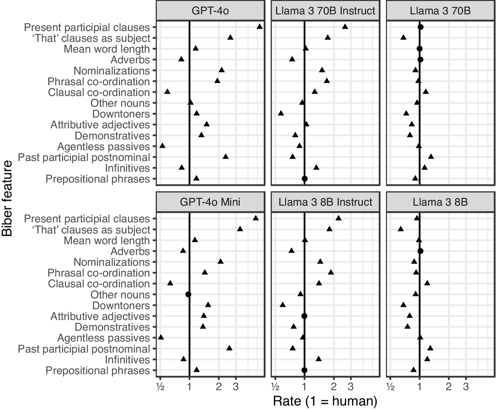
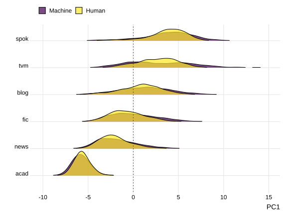
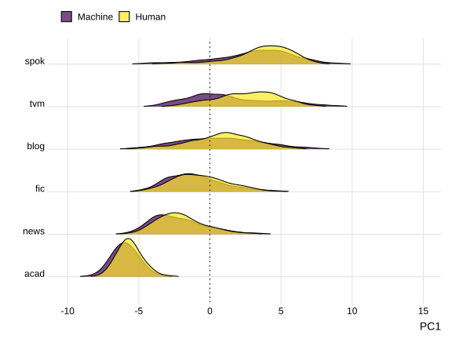
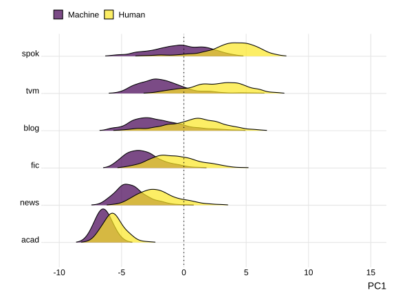
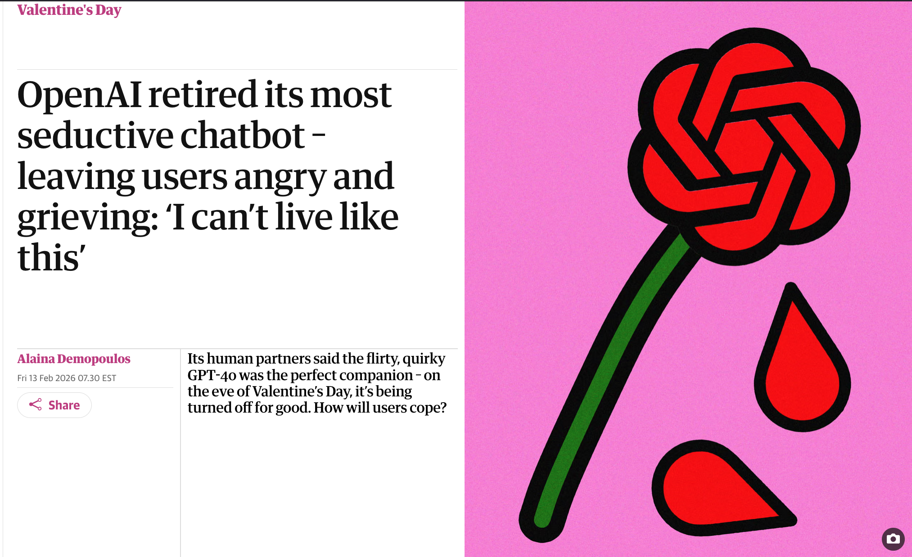
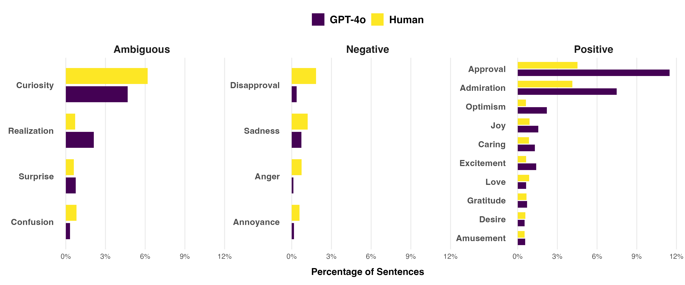
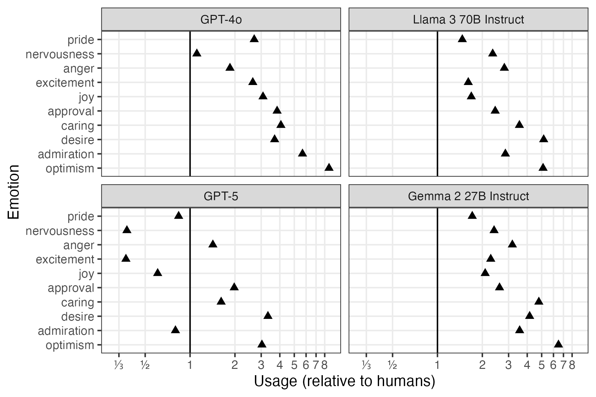

# The Challenge {background-color="#40666e"}

## The Pedagogical Problem

### "Something feels wrong about this writing..."

::: {style="font-size: 85%;"}
Writing instructors increasingly report an intuitive **"feeling"** that something is wrong with LLM-generated academic writing:

- Inappropriate tone
- Excessive positivity  
- What researchers call **"sycophancy"** [e.g., @singh_openai_2026; @perez_discovering_2022]

:::

::: {.fragment style="font-size: 80%; margin-top: 20px;"}
**But this intuition leaves us helpless:**

- No concrete language to discuss with students
- No systematic methods to identify differences
- Vague warnings: *"This doesn't sound right"* or *"ChatGPT doesn't write like a scholar"*
:::

## Why This Matters

### Students need more than warnings

::: {style="font-size: 80%;"}
**The reality:**

- Students are already using LLMs for academic writing
- Need accessible frameworks to understand *how and why* LLM writing differs

**Our approach:**

Transform impressionistic observations → teachable knowledge

Using **multivariate sentiment** to make visible what experienced writers intuitively recognize
:::

# Our Approach {background-color="#40666e"}

## Background

{width="95%"}

::: {style="font-size: 90%;"}
- LLMs have stylistic expressions that are distinct from human writers.
- Those tendencies are exaggerated through model tuning (RLHF).
- Model families have their own stylistic "fingerprints" [@reinhart_llms_2025].
:::

## Background

:::: {.columns}

::: {.column style="width: 10%; font-size: 80%;"}
←

More Information Production
:::

::: {.column style="width: 80%; font-size: 80%;"}

:::

::: {.column style="width: 10%; font-size: 80%;"}
→

More Involved
:::

::::

## Background

::: {.columns}

::: {.column style="width: 10%; font-size: 80%;"}
←

More Information Production
:::

::: {.column style="width: 80%; font-size: 80%;"}

:::

::: {.column style="width: 10%; font-size: 80%;"}
→

More Involved
:::

::::

## Background

::: {.columns}

::: {.column style="width: 10%; font-size: 80%;"}
←

More Information Production
:::

::: {.column style="width: 80%; font-size: 80%;"}

:::

::: {.column style="width: 10%; font-size: 80%;"}
→

More Involved
:::

::::

## Background

::: {.columns}

::: {.column style="width: 10%; font-size: 80%;"}
←

More Information Production
:::

::: {.column style="width: 80%; font-size: 80%;"}

:::

::: {.column style="width: 10%; font-size: 80%;"}
→

More Involved
:::

::::

## Background

## Research Questions

::: {style="font-size: 90%;"}
**1. How do LLMs differ from human academic writing in emotional expression?**

- What patterns of sentiment distinguish LLM outputs from human texts?
- How pronounced are these differences in academic registers?

**2. How do different LLM models compare?**

- Are emotional patterns stable across models?
- What does this variability mean for pedagogy?
:::

## The HAP-E-2 Corpus

### Human-AI Parallel Corpus in English

::: {style="font-size: 80%;"}
**Design:**

- 8,290 human-authored texts
- Reproduced across 12 LLM models
- 6 registers: blog, TV/movies, spoken, fiction, news, **academic**

**Parallel construction:**

- Human text (≈500 words) → seed prompt for LLM
- LLM generates next 500 words
- Compare: what actually follows vs. what model produces

**Why this matters:** More comparable than arbitrary human vs. AI samples
:::

## Why Sentiment Analysis?

### Advantages over traditional approaches

::: {style="font-size: 80%;"}
**Dictionary-based stance/engagement studies:**

- Excellent for specific lexical patterns (e.g., hedges, boosters)
- Provide concrete lexical bundles for teaching
- Limited to predetermined word lists

**Multivariate sentiment analysis:**

- Captures broader affective range (28 emotion categories)
- Uses contextual understanding (not just word lists)
- More intuitive for students: "approval," "admiration," "disapproval"
- Reveals patterns dictionary searches miss
:::

## The GoEmotions Model

### 28 emotion categories

::: {style="font-size: 75%;"}
| Category | Emotions |
|----------|----------|
| **Positive** | admiration, amusement, approval, caring, desire, excitement, gratitude, joy, love, optimism, pride, relief |
| **Neutral** | curiosity, confusion, neutral, realization, surprise |
| **Negative** | anger, annoyance, disappointment, disapproval, disgust, embarrassment, fear, grief, nervousness, remorse, sadness |

**BERT-based model** trained on 58,000 human-annotated Reddit comments

**Each sentence** gets probability scores across all 28 categories (not mutually exclusive)
:::

## What GoEmotions Captures (and Doesn't)

### Affordances and limitations

::: {.columns style="font-size: 75%;"}

::: {.column width="50%"}
**Limitation: Misses subtle stance markers**

Human academic sentence [@hyland_stance_2005]:

> "In the chaparral [at least]{style="background-color: #f5b2c6; opacity: 0.75;"}, low temperature episodes [usually]{style="background-color: #f5b2c6; opacity: 0.75;"} result in gradual freeze-thaw event."

\
**GoEmotions:** 97% neutral

::: {.fragment style="font-size: 90%; margin-top: 15px;"}
✗ Hedges and scope limiters read as neutral
:::
:::

::: {.column width="50%"}
**Affordance: Captures overall tonal quality**

GPT-4o academic sentence:

> "Such an approach [exemplifies]{style="background-color: #40666e; color: white;"} a necessary shift that [can]{style="background-color: #f5b2c6; opacity: 0.75;"} [significantly]{style="background-color: #40666e; color: white;"} strengthen our [collective resolve]{style="background-color: #40666e; color: white;"} against the looming impacts..."

**GoEmotions:** 99% approval

::: {.fragment style="font-size: 90%; margin-top: 15px;"}
✓ Evaluative language drives emotional valence despite hedge word
:::
:::

:::

::: {style="font-size: 65%; margin-top: 20px; text-align: center;"}
GoEmotions complements dictionary approaches: reveals **register-level appropriateness** beyond specific lexical choices
:::

# Results: GPT-4o Case Study {background-color="#40666e"}

## Overall Patterns Across All Registers

### GPT-4o vs. Human Writing

{width="95%"}

::: {style="font-size: 75%;"}
- GPT-4o uses **2x more approval and admiration** than human writers
- **Less neutral** language overall (neutral emotion not shown in chart)
- Reduced negative emotions (disapproval, sadness)
:::

## Academic Register: The Stark Difference

### A much more pronounced gap

::: {style="font-size: 85%;"}
**Human academic writing:**

- 88.6% neutral language
- 8.3% approval, 1.0% admiration
- Careful, hedged claims

**GPT-4o academic writing:**

- 65.5% neutral language (-23 percentage points!)
- 31.7% approval, 5.5% admiration
- Emphatic, broad evaluations
:::

## The Quality of Approval Matters

### Not just how much, but how it's expressed

::: {style="font-size: 80%;"}
**Human academic writer (hedged, scoped):**

> "International mobility **may**, in turn, have a positive impact on large distance collaborations as mobile inventors act as bridges across teams..."

**GPT-4o (emphatic, broad scope):**

> "The **marriage** of these approaches **fosters** a more nuanced appreciation of the Earth's complex systems, **empowering us** to address the **pressing** environmental and engineering **challenges of our time**."
:::

::: {.fragment style="font-size: 75%; margin-top: 20px;"}
Both tagged as "approval" — but the register appropriateness differs dramatically
:::

## Sycophancy Quantified

### What instructors intuitively recognize

::: {style="font-size: 85%;"}
GPT-4o doesn't just use more positive language — it expresses **emphatic approval** in contexts where human academic writers employ:

- Hedges (*may, might, could*)
- Carefully scoped claims (specific, limited contexts)
- Neutral or slightly positive evaluations

**This mirrors common novice writing problems:**

- Claims that are too broad
- Excessive enthusiasm without supporting evidence
- Inappropriate emotional intensity for academic contexts
:::

# Model Comparison {background-color="#40666e"}

## Different Models, Different Emotions

### Academic register across 4 LLMs

{width="75%"}

::: {style="font-size: 70%;"}
Rate of emotions relative to human usage (1 = human usage rate)
:::

## The Instability Problem

### Emotional patterns shift with model updates

::: {style="font-size: 85%;"}
**GPT-4o → GPT-5 Mini:**

- Admiration: Decreased (5.5% → 0.8%)
- Approval: Still high, but reduced (31.7% → 16.3%)
- Optimism: Dropped from 8x human levels → 3x

**"The Day ChatGPT Went Cold" [@freedman_day_2025]:**

- OpenAI "fixed" excessive positivity
- Users complained new version wasn't "friendly" enough
- Shows: cannot learn model-specific corrections
:::

## Emotional Patterns Across Models

### Academic register comparison

::: {style="font-size: 70%;"}
| Emotion | Human | Llama 3 70B | Gemma 2 27B | GPT-4o | GPT-5 Mini |
|---------|-------|-------------|-------------|---------|------------|
| **neutral** | 88.6% | 73.0% | 71.2% | 65.5% | 84.1% |
| **approval** | 8.3% | 20.1% | 21.5% | 31.7% | 16.3% |
| **admiration** | 1.0% | 2.8% | 3.5% | 5.5% | 0.8% |
| **optimism** | 0.5% | 2.4% | 3.0% | 4.0% | 1.4% |
| **disapproval** | 1.1% | 1.0% | 0.8% | 0.4% | 0.6% |
:::

::: {style="font-size: 75%; margin-top: 15px;"}
Different models = different emotional signatures = no universal "fix" for AI writing
:::

# Pedagogical Implications {background-color="#40666e"}

## From Intuition to Instruction

### The power of naming

::: {style="font-size: 85%;"}
**Instead of:** *"This doesn't sound right"*

**We can say:** *"GPT-4o uses 4x more approval language than human academic writers and expresses that approval with broader scope and less hedging"*

**This specificity helps students:**

- Understand *what* makes LLM output inappropriate
- Develop critical awareness of register and tone
- Make informed decisions about when/how to use LLMs
:::

## Developing Critical AI Literacy

### Transferable skills, not model-specific fixes

::: {style="font-size: 85%;"}
**Students learn to recognize:**

- When approval or admiration in their drafts exceeds disciplinary norms
- How emotional register signals expertise vs. novice writing
- Why different rhetorical situations require different affective stances

**Not memorizing:** "GPT-4o uses too much approval language"

**But developing:** General awareness of emotional appropriateness in academic writing
:::

## Classroom Applications

### From research to practice

::: {style="font-size: 75%;"}
**Writing analytics assignments:**

- Students analyze LLM outputs using sentiment analysis frameworks
- Compare emotional patterns in expert vs. novice vs. AI writing
- Develop metacognitive awareness about genre and register

**Revision practices:**

- Add emotional register to revision checklists
- Ask: "Does this approval seem appropriately scoped?"
- Consider: "Is my claim hedged at the right level?"

**Contrastive rhetoric:**

- Have students identify inappropriate emotional patterns in LLM outputs
- Build critical awareness by probing tools for limitations
:::

## Equity and Access

### Supporting students and instructors

::: {style="font-size: 85%;"}
**Why sentiment analysis particularly helps:**

- Makes **tacit** conventions **explicit**
- Provides accessible metalanguage (no linguistics degree needed)
- Scaffolds understanding of disciplinary emotional norms

**Result:** More equitable access to academic discourse conventions
:::

# Discussion {background-color="#40666e"}

## Why Emotions Matter in Academic Writing

### An accessible entry point

::: {style="font-size: 85%;"}
**Sentiment analysis provides:**

- Intuitive categories students can understand
- Concrete data instructors can reference
- Bridge between computational analysis and rhetorical awareness

**Complements traditional approaches:**

- Lexical bundles → specific phrases to use
- Sentiment analysis → broader register appropriateness
- Together: comprehensive understanding of academic writing conventions
:::

## Methodological Trade-offs

### What we gain and what we sacrifice

::: {style="font-size: 80%;"}
**What sentiment analysis doesn't do:**

- Provide specific lexical bundles ("use *may* instead of *will*")
- Identify exact stance markers to teach
- Replace dictionary-based corpus linguistics

**What sentiment analysis does do:**

- Capture broader emotional impressions across many features
- Work with contextual understanding (not just word lists)
- Provide accessible framework for non-linguists
- Scale to large corpora efficiently
- Quantify what experienced writers recognize intuitively
:::

## Key Takeaways

::: {style="font-size: 85%;"}
1. **LLMs produce measurably different emotional registers** — especially in academic writing

2. **Patterns vary across models** and will continue to shift with updates

3. **Need stable frameworks,** not model-specific knowledge

4. **Sentiment analysis provides accessible metalanguage** for discussing register appropriateness

5. **Equity matters:** Explicit instruction benefits those who struggle most with tacit conventions
:::

## Conclusion

### The Power of Naming

::: {style="font-size: 85%;"}
By quantifying the affective dimensions of academic writing, we transform:

- **Instructor helplessness** → informed, strategic teaching
- **Vague intuitions** → concrete, shareable knowledge  
- **Impressionistic warnings** → evidence-based explanations

**We give students agency:**

- To recognize inappropriate emotional register
- To evaluate LLM outputs critically
- To make deliberate choices about when and how to use these tools

**In ways that enhance** — not limit — their academic development
:::

## Thank You

### Questions?

::: {style="font-size: 80%;"}
**Contact:**

- Sarah Mansfield: smansfie@andrew.cmu.edu
- Michael Laudenbach: michael.laudenbach@njit.edu
- David Brown: dwb2@andrew.cmu.edu

**Resources:**

- HAP-E Corpus: <https://huggingface.co/datasets/browndw/human-ai-parallel-corpus-2>
- GoEmotions Model: ModernBERT-large-english-go-emotions
:::

## Works Cited

